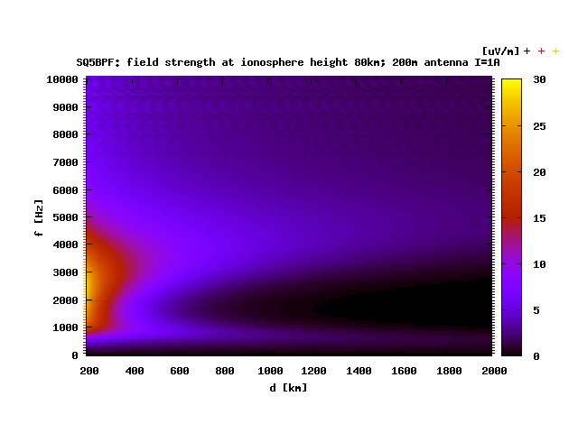
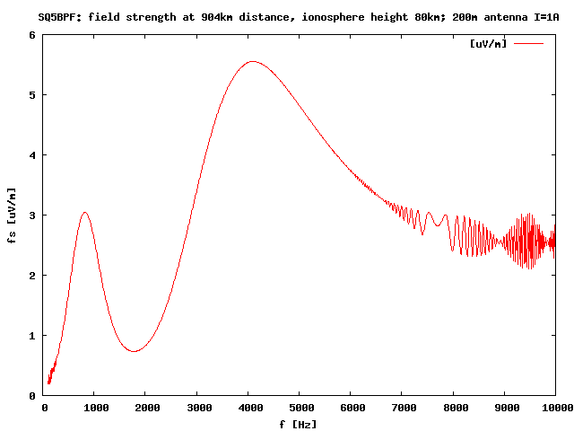
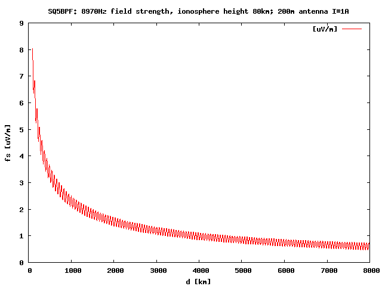

# wavevlf
Earth-ionosphere waveguide propagation model
based on eqns (5.2 - 5.11)  of D. Lowenfels paper
E(z) of TEM mode in a spherical waveguide cavity 
programme by Piotr Mlynarski, SQ7MPJ, May-June, 2010

This is a minor modification of the original program by Piotr Mlynarski, SQ7MPJ
I made some minor modifications:

- make the source compile under gfortran anf fort77
- provide a makefile for unix
- provide this README
- provide an additional program vlfgraph, useful for generating graphs
- provide some examples of using vlfgraph with Gnuplot

To compile, edit the Makefile to use your compiler of choice and other 
parameters, and run:

$ make

Compilation was tested under fort77, and gfortran, with GNU make, under 
Debian/GNU Linux. Unfortunately vlfgraph.f doesn't compile under f77, but
requires fortran 95 (such as gnu fortran). Everything here should work 
under any sane Unix/Linux environment. It probably runs unmodified under 
Cygwin, and should be easy enough to run under Windows.

########################
###  The wavevlf program
########################

wavevlf expects a file called fort.7, and puts the output in fort.8
A sample of the input file structure is in the file DANE.DAT

To test the result run: 

$ make test
 
the output should like:
calculated results:     Effective Field [microV/m] =     .24940078E+01
should be close to:     Effective Field [microV/m] =    0.24940078E+01

########################
###  The vlfgraph program
########################

This is an additional program, useful for making graphs. It expects a file
called vlfgraph.in, and outputs the calculated values to standard output.
A sample of the input file structure is provided in the files example1.in,
example2.in, example3.in

vlfgraph outputs lines like this containing
distance [km]              frequency [Hz]              field strength [uV/m]
for example:
200.00000000000000         100.000000000000000         0.35584390309396130

If you have gnuplot installed, to make some sample graphs, run:

$ make graphs

This will produce graphs: example1.png, example2.png and example3.png.

The original program is in wavevlf_ext_unix.tar.gz. It was posted to
the rsgb-lf-group mailing list many years ago with the intent to be publically
avaliable. This repository contains my modifucationof this program, and is
relicensed GPL v3.
Unfortunately  Piotr Mlynarski, SQ7MPJ passed away several years ago.

Good luck,
Jacek Lipkowski / SQ5BPF

